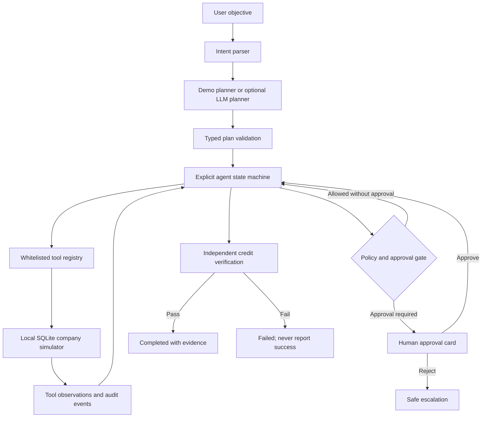

# Architecture

## Boundaries

- `app.py` only renders the Streamlit interface and calls the application service.
- `agent.py` owns the resumable run loop and persists after each tool observation.
- `state_machine.py` constrains legal status transitions.
- `planner.py` parses amount intent and produces either a deterministic demo plan or a validated OpenAI-compatible plan.
- `tools/registry.py` validates every tool's Pydantic input and rejects unregistered names.
- `tools/support.py` contains the ten tool handlers; handlers can only access the fictional SQLite environment.
- `database.py` owns transactions, seed data, run persistence, approvals, state changes, and audit entries.
- `fixtures/` contains only fictional customer, ticket, and policy data.

## Safety properties

1. The planner can name tools but cannot supply executable code, URLs, shell commands, or arbitrary arguments.
2. Agent code derives tool arguments from validated intent and observed local records.
3. Policy is checked before proposal creation. Proposals do not modify balances.
4. Applying a credit requires a recorded approval when the policy or configured threshold requires it. The SQLite layer enforces this independently of the UI.
5. An operation key and a per-ticket uniqueness rule prevent repeat credits.
6. Verification reads the persisted credit separately after the write. Only a matching read permits `completed`.
7. Retries are bounded; simulated and unexpected tool failures never become a successful summary.
8. Audit events include tool outcomes, retries, approvals, escalation, and run completion. Structured application logs omit request and account payloads.

## State persistence

Every run is serialized as a validated `RunState` document in SQLite after transitions, tool attempts, observations, and decisions. Approval resumes the same run ID, plan, collected context, and operation key.