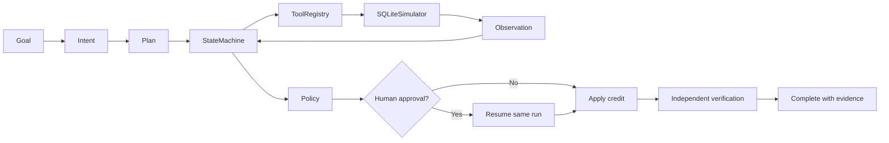

# SupportOps AI Worker

SupportOps AI Worker is a runnable Python 3.12 prototype for a narrow autonomous support-operations task: inspect the highest-priority unresolved billing ticket, check the customer account and compensation policy, ask a person before a risky credit, apply only an authorized credit, then independently verify the change and return evidence.

It is built for the CentrAlign AI Engineering Intern assignment. The company, tickets, customers, and account data are fictional.

## Working example

In the app, select **Successful billing resolution ($75; approval required)** and click **Run task**. The agent:

1. Lists fictional billing tickets and selects the highest-priority unresolved one.
2. Reads the ticket and linked account.
3. Checks the compensation policy and threshold.
4. Records a proposal without changing the account.
5. Pauses with an approval card because $75 exceeds the default $50 approval threshold.
6. Resumes the same persisted run after a reviewer approves.
7. Applies the credit once, reads the account independently, and returns evidence IDs.

The scripted demo automatically makes the approval decision so one command can demonstrate a complete offline run.

## Features

- Ten typed, whitelisted support tools with Pydantic input validation.
- SQLite persistence for runs, tickets, customer accounts, proposals, approvals, credits, escalations, and audit logs.
- Explicit state machine with statuses `planning`, `executing`, `waiting_for_approval`, `verifying`, `completed`, `failed`, and `needs_human_input`.
- Deterministic offline planner used in demo mode; optional OpenAI-compatible planner that can generate typed plans.
- Backend-enforced human approval, transactional account updates, idempotency keys, and per-ticket duplicate-credit prevention.
- Independent verification: completion is impossible unless the expected credit is read back successfully.
- Bounded retries, retry timeline, a one-time transient CRM failure simulation, and permanent failure simulation.
- Streamlit interface with task examples, plan, timeline, approval card, observations, final state, verification, evidence, and expandable audit log.

## Architecture



The detailed component boundaries and safety properties are in [ARCHITECTURE.md](ARCHITECTURE.md).

## Agent loop

`Goal → Understand → Plan → Execute → Observe → Adapt → Human Approval when required → Verify → Complete`

- **Understand:** a typed `ParsedIntent` records the objective and requested credit. If there is no explicit dollar amount, the demo assumes $75.
- **Plan:** demo mode makes a deterministic plan. Optional LLM mode can suggest a typed tool sequence; the app rejects unknown tools and unsafe ordering.
- **Execute:** arguments are derived from the parsed intent and records returned by the local tools. The model cannot pass tool arguments through.
- **Observe and adapt:** each tool attempt, failure, retry, and result is added to the persisted run and audit trail.
- **Approval:** any eligible credit above the configured threshold is proposed but not applied. A reviewer can approve or reject from the UI.
- **Verify:** a separate tool reads the account after the write. Failed verification results in `failed`, never `completed`.

## Whitelisted tools

| Tool | Purpose |
|---|---|
| `list_tickets` | Filter tickets by status, priority, category, and page. |
| `get_ticket` | Retrieve a ticket by ID. |
| `search_tickets` | Search subject, description, and tags with pagination. |
| `get_customer_account` | Read the account associated with a ticket. |
| `check_compensation_policy` | Check eligibility, applicable rule, and approval requirement. |
| `propose_credit` | Record a proposal without changing the account. |
| `apply_credit` | Apply the proposed credit transactionally after backend approval checks. |
| `verify_credit` | Independently confirm the credit and read the resulting balance. |
| `escalate_ticket` | Create an escalation for a specialist. |
| `get_audit_log` | Read the evidence trail for the run. |

## State model and approvals

Each `RunState` contains the run ID, original goal, parsed intent, status, plan, current step, tool calls, observations, retries, collected context, pending approval, expected outcome, verification result, summary, evidence, errors, timeline, and failure-simulation flags.

Approval decisions are stored in SQLite and can be recorded only once for a pending proposal. The UI is not the security boundary: `Database.apply_proposal` checks approval status and threshold before changing an account. Rejection leaves the account untouched and creates an escalation.

## Failure recovery and verification

`MAX_RETRIES` bounds retries after a fictional timeout. Backoff doubles for each retry, and every failed attempt appears in the state and audit trail. The UI has both a one-time transient failure and permanent-failure scenario. Permanent failure ends the run as `failed` without a credit or success claim.

Verification checks the persisted credit by customer ID, amount, and operation key after the write. The successful final response includes ticket, credit, and audit evidence identifiers.

## Security decisions

- The tool registry rejects unregistered tools and extra input fields.
- No arbitrary code, shell commands, or user-selected URLs can be invoked.
- Demo mode makes no LLM or external network calls.
- The optional planner receives only the redacted goal and parsed intent. It can produce tool names and explanations, not arguments or actions.
- Credentials are read only from environment variables and never included in application logs. `.env` is ignored by Git; `.env.example` contains placeholders.
- All company data is local, fictional, and seeded into SQLite.
- State-changing writes use SQLite transactions, approval guards, and idempotency keys.

## Demo mode setup

Requirements: Python 3.12 and [uv](https://docs.astral.sh/uv/).

```bash
uv sync --extra test
uv run pytest -q
DEMO_MODE=true uv run python scripts/demo.py
DEMO_MODE=true uv run streamlit run app.py
```

The Streamlit app uses `data/supportops.sqlite3` by default. The demo script uses `data/demo.sqlite3`. Both databases are local; the app's **Reset demo** control clears its run history and simulated account changes, then restores the fictional fixtures.

Useful configuration:

| Variable | Default | Purpose |
|---|---:|---|
| `DEMO_MODE` | `true` | Use the deterministic planner without network access. |
| `SUPPORTOPS_DB_PATH` | `data/supportops.sqlite3` | SQLite file path. |
| `APPROVAL_THRESHOLD` | `50` | Dollar amount above which an eligible credit requires approval. |
| `MAX_RETRIES` | `2` | Number of retries after the first attempt; maximum 10. |
| `RETRY_BASE_DELAY_SECONDS` | `0.05` | Base exponential backoff delay. |

## Optional LLM mode

Set `DEMO_MODE=false` and provide `LLM_API_KEY`, `LLM_BASE_URL`, and `LLM_MODEL`. The client calls the OpenAI-compatible `/chat/completions` endpoint with a strict JSON response request and bounded timeout. For example, the base URL can be `https://api.openai.com/v1`.

Keep credentials in Replit Secrets or your local environment; do not paste them into the task input or commit them. LLM mode requires network access and a compatible service. Demo mode remains fully functional without credentials or network access.

## Run commands

```bash
uv sync --extra test
uv run pytest -q
DEMO_MODE=true uv run python scripts/demo.py
DEMO_MODE=true uv run streamlit run app.py
```

Run the app on a specific port or bind address with Streamlit options, for example:

```bash
DEMO_MODE=true uv run streamlit run app.py --server.address=0.0.0.0 --server.port=5000
```

Container build/run:

```bash
docker build -t supportops-autonomous-ai-worker .
docker run --rm -p 5000:5000 supportops-autonomous-ai-worker
```

## Assumptions

- The goal concerns a billing ticket and at most one credit.
- The worker chooses the highest-priority unresolved billing ticket; ties break by ticket ID.
- Policy permits credits up to $100 on open or pending billing tickets; the configured threshold determines if human approval is also required.
- The main successful example requests $75 and therefore pauses for approval at the default $50 threshold.
- The SQLite simulator is the source of truth for this prototype.

## Known limitations and next steps

This is a safe simulation, not a production CRM integration. Reviewer authentication, real CRM permissions, production database infrastructure, robust natural-language extraction, signed audit retention, notification delivery, and deployment security review would be required before handling live accounts. See [LIMITATIONS.md](LIMITATIONS.md).

## Models, frameworks, and external components

- Python 3.12, Streamlit, Pydantic v2, SQLite, and httpx.
- pytest and pytest-asyncio for tests.
- `uv` for dependency management.
- Optional OpenAI-compatible planning endpoint; no model or external service is needed in demo mode.

## Demo video

Final demo video: **[link to be added]**
Live Project Link:**[https://supportops-autonomous-ai-worker.streamlit.app]**

